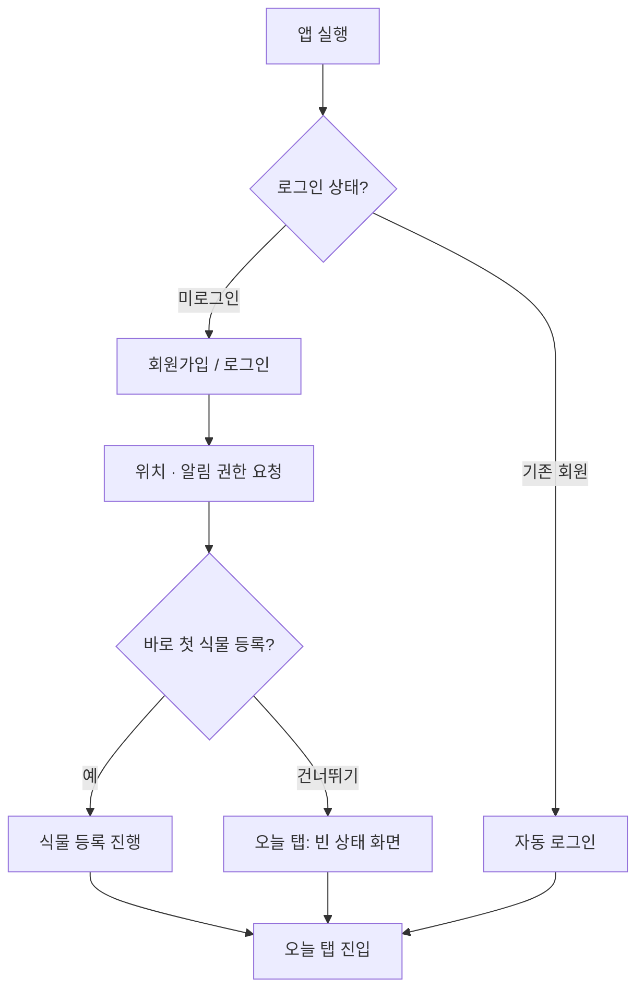
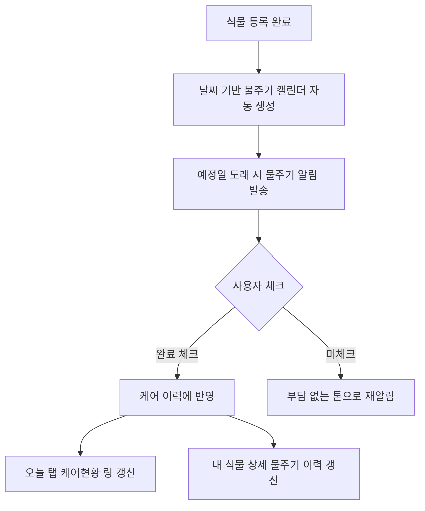
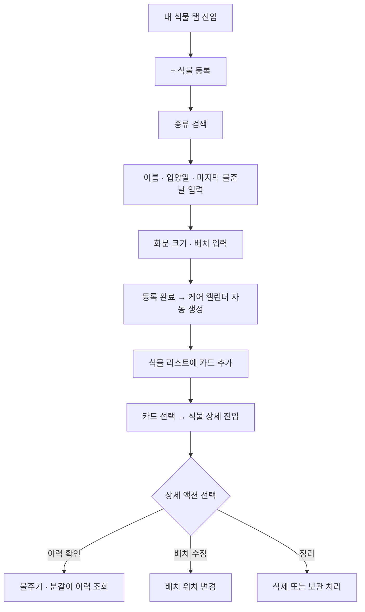
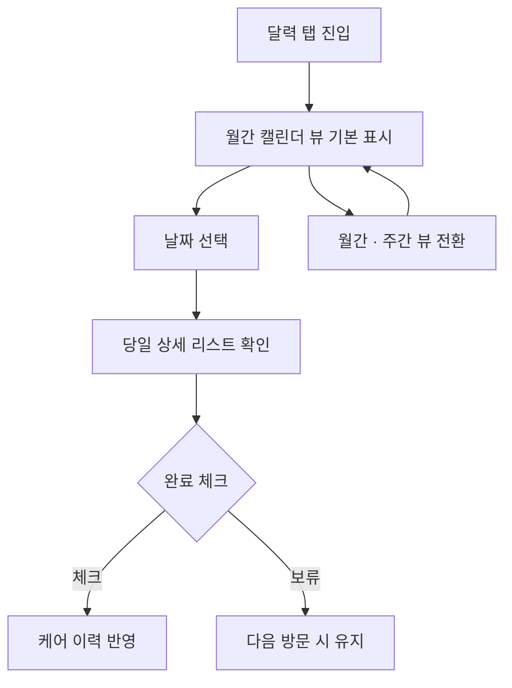
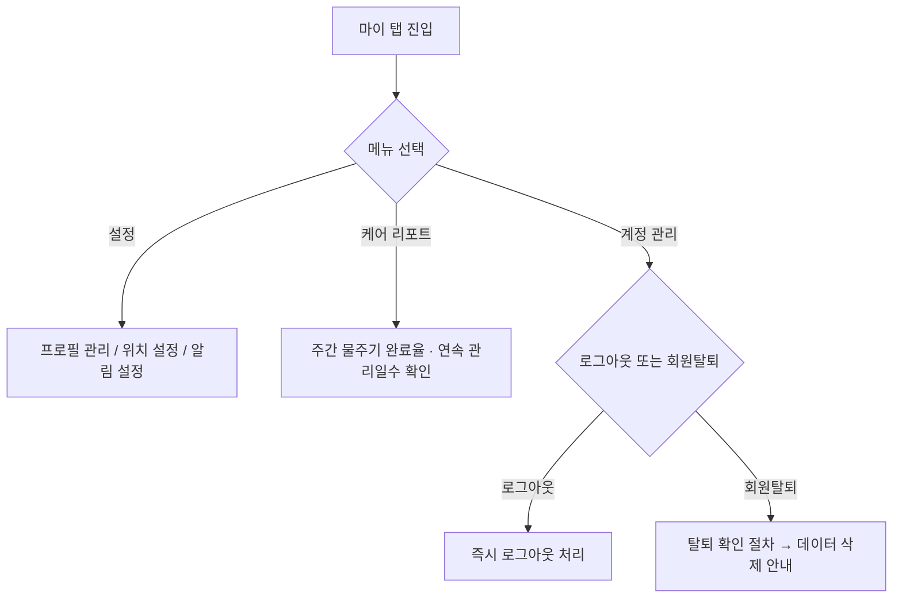
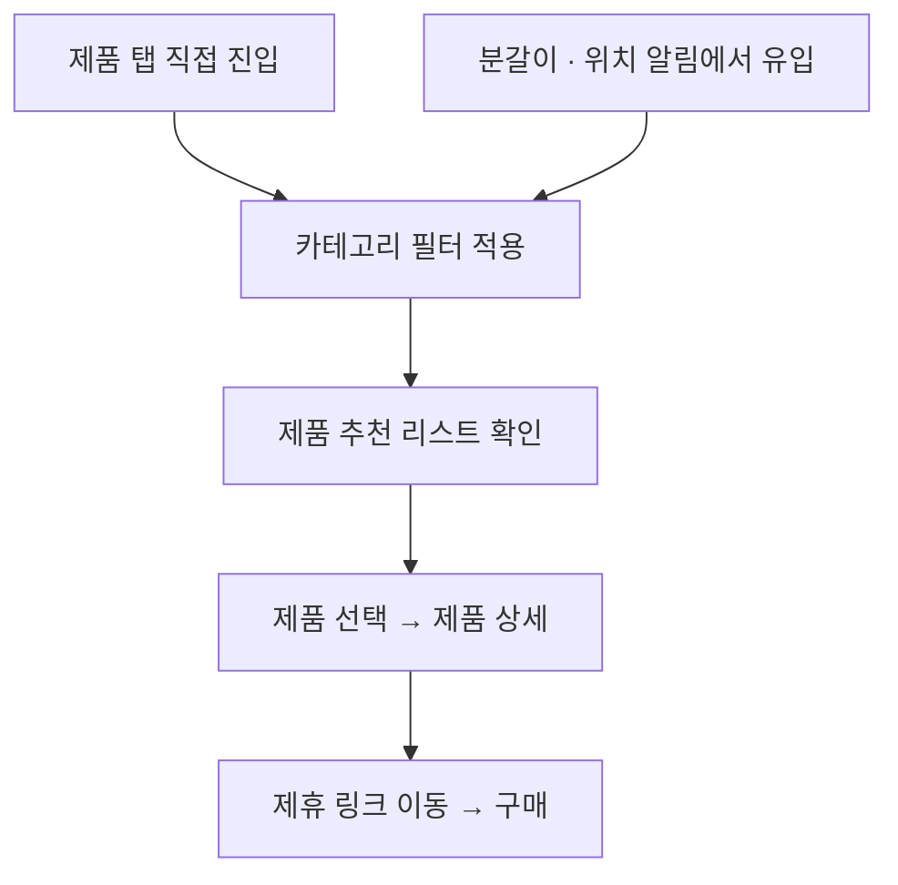
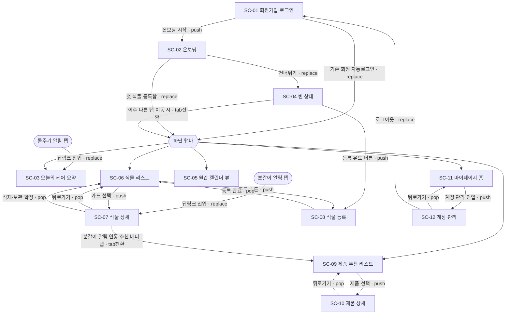
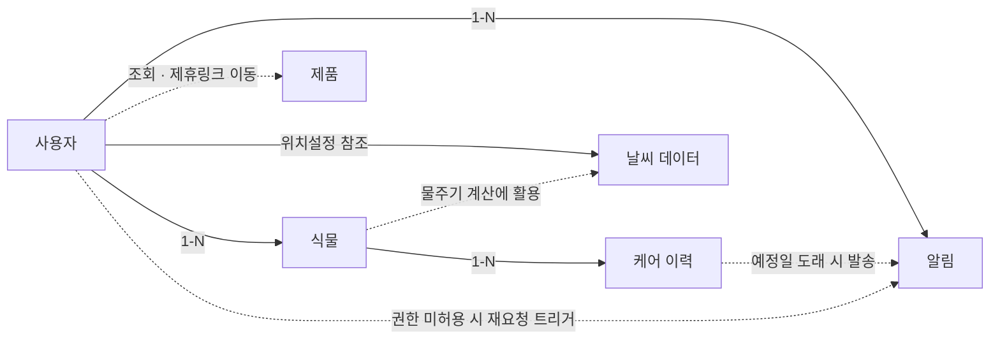

# 식집사 업그레이드 프로젝트 — 기획 콘텐츠 노트

> 이 파일은 spec.md(진행상황 추적)와 별개로, 단계별로 함께 찾고 확정한 "실제 내용"을 누적 기록하는 문서입니다.
> 각 단계 논의가 끝날 때마다 해당 섹션을 채우고, 확정되면 [확정] 표시를 남깁니다.
> 목표: '식집사'를 AI 기반으로 업그레이드해 기획부터 배포까지 완료하는 것. 본문은 볼드 라벨 + 짧은 불릿 중심으로 쓰고, 줄글이 더 매력적으로 읽히는 부분에서만 짧게 씁니다. 표는 여러 대상을 직접 비교할 때만 사용합니다. Notion에 그대로 붙여넣을 수 있습니다.
> 마지막 업데이트: 2026-08-20 (식물 5종 추가로 plants.json 29종화, products.json 16개 작성, 두 파일 이미지 링크 소싱)

---

## 0단계. 리서치

> 상태: 초안 (DRAFT)

**핵심 결론**
- 배경 — 1인가구·외로움 증가로 반려식물 수요 지속 증가, 초보자의 문제(날씨 대응·관리법·타이밍)는 1년째 그대로
- 식집사의 본질 — "날씨×식물 특성을 조합해 물주기·화분갈이·화분 위치를 미리 알려주는 예측형 케어"
- 다음 방향 — 이 예측 정확도를 AI로 더 끌어올리는 것
- 채택하지 않은 방향 — 사진으로 문제를 진단하는 사후 대응형 AI (이미 경쟁사들이 보유, 식집사만의 차별점 아님)

### 왜 지금인가

- 1인가구 증가 — 804.5만 가구, 전체의 36.1%로 역대 최고치. 외로움 체감률도 48.9%로 전체 평균(38.2%)보다 높음 (경향신문, 2025)
- 반려식물 시장 성장 — 국내 반려식물 산업 규모 2조 4,215억 원, 국민 34%(약 1,745만 명)가 반려식물을 기름 (농촌진흥청, 2025)
- 정서적 니즈로 연결 — 반려식물을 기르는 목적 1위는 정서적 교감·안정(54.8%), 1인가구는 식물을 생명체로서 존중하는 공감도가 73%로 특히 높음 (농촌진흥청, 2023)

- 1인가구 증가와 반려식물 수요의 상관관계 — 혼자 사는 사람이 늘수록 정서적 교감 수요도 증가

### 무엇이 달라졌나 — v1.0(2025) → 지금(2026)

| | v1.0 (2025) | 지금 (2026) |
|---|---|---|
| 핵심 차별화 | 날씨 연동 캘린더 | 날씨 연동 예측 + (향후) AI 기반 등록·인식 보조 |
| 경쟁 구도 | 기록형(Plantgram)·정보제공형(Planta) | + AI 네이티브 진단형 앱(Leafora AI, Botai, 그루우) 신규 진입 |

- 차별화는 아직 유효 — 사진 한 장으로 진단하는 AI 앱들이 여럿 등장했지만, 이들도 날씨 연동 자동화는 하지 않음. "사후 진단" 경쟁에 뛰어들기보다, "예측·예방"이라는 원래 자리를 더 정교하게 파는 쪽이 식집사다움에 맞음
- 타겟팅도 아직 유효 — 반려식물을 기르는 비율은 30대 이하가 37.2%로 전 연령대 중 가장 높음 (농촌진흥청, 2024). v1.0이 2030을 타겟으로 잡은 방향은 최신 데이터로도 그대로 맞음

### 시장은 충분히 크다

- 전체 시장 — 국내 반려식물 산업 전체, 2조 4,215억 원
- 우리가 노릴 시장 — 2030 초보 식집사층
- 출시 초기 목표 — 특정 커뮤니티·SNS로 확보 가능한 얼리어답터

- 관건 — 시장 크기가 아니라 그 안에서 무엇으로 이기는가

### 사용자는 여전히 같은 문제를 겪는다

**v1.0 인터뷰에서 확인된 초보자의 어려움 3가지 (2026년에도 유효)**
1. 관리법을 몰라 헷갈림 — 식물마다 다른 물주기·환경 기준
2. 날씨 변화에 어떻게 대응해야 할지 모름
3. 물 주는 타이밍을 놓침

- 미해결 방증 — "겉흙 확인법", "여름철 초보 실수담" 등 관련 콘텐츠가 2026년에도 꾸준히 발행(viewapt.co.kr; 다음뉴스, 2026)

### 경쟁사 중 날씨를 다루는 곳은 없다

| 서비스 | 유형 | 날씨 연동 |
|---|---|---|
| Plantgram | 커뮤니티형 | ✕ |
| Planta | 정보제공형 | ✕ |
| Leafora AI·Botai·그루우 | AI 진단형 (2026 신규) | ✕ |

- 공통점 — 유형(커뮤니티형·정보제공형·AI진단형)과 무관하게 날씨 데이터를 케어 로직에 실시간 반영하는 곳은 없음, 식집사가 선점해야 할 자리

### 결론

> **결론**
- 경쟁사 — "이미 생긴 문제를 진단"하는 데 집중
- 식집사 — 애초에 "문제가 생기기 전에 미리 알려주는" 예측형 케어로 출발
- 싸움의 본질 — 이 예측을 얼마나 정확하고 편하게 만드는가
- AI의 역할 — 진단 도구가 아니라 예측 정확도를 높이는 보조 수단(예: 식물 등록 시 사진으로 종류 자동 인식)
- 연결 — 1단계 상위기획의 비전·컨셉으로 이어짐

**다음 리서치 과제**
- 식물 관리 앱 자체에 대한 수요 데이터, 초보자 실패율 정량 데이터는 아직 확보하지 못함 — 상위기획 확정 전 미니 설문 등으로 보강 예정
- 화분갈이·화분 위치에 대한 사용자 니즈는 아직 정량/정성 데이터로 검증되지 않음 (현재는 v1.0 페르소나 인터뷰 수준의 정성적 근거만 있음) — 미니 설문에 포함 예정

**MVP 범위 메모**
- AI 기반 식물 인식·환경 추정은 기획서에는 포함하되, 실제 구현(바이브코딩)에서는 비용·정확도 리스크로 제외하고 향후 확장 로드맵으로 둠
- MVP 핵심: 검색/선택 방식의 직접 식물 등록 + 날씨 연동 캘린더 + 알림 + 케어 이력

---

## 1단계. 상위기획 [확정]

### ① 서비스 전략

**한 줄 컨셉**
> 날씨(온도·습도)를 기반으로 물주기 타이밍을 예측하고, 화분갈이·화분 위치까지 미리 알려주는 예측형 식물 케어 앱

**비전 · 미션**
- 비전: 초보 식집사가 식물을 잃지 않는 세상
- 미션: 관리 지식이 없어도, 예측형 케어로 누구나 식물을 건강하게 키울 수 있도록

**서비스의 필요성**
- 식물을 못 키우는 가장 흔한 이유는 물 부족이 아니라 불규칙한 물주기 — 화초 고사의 1위 원인으로 꼽힘 (UConn Extension, 2022)
- 초보자는 "물 주는 게 정성"이라 여겨 과습으로 뿌리를 썩히는 경우가 특히 많음
- 물주기 타이밍만 식물·날씨에 맞게 지켜도 대부분 잘 삶 — 문제는 그 기준이 식물마다, 계절마다 달라 초보자가 스스로 판단하기 어렵다는 것
- 화분갈이·화분 위치도 같은 맥락이지만, 생존에 가장 결정적인 건 물주기

**핵심 기능 3가지**
1. 물주기 예측 (핵심) — 날씨(온도·습도·강수)를 반영해 자동 보정되는 물주기 캘린더. 과습으로 인한 뿌리썩음처럼 초보자가 가장 많이 겪는 실패를 막는 것이 이 서비스의 1순위 기능
2. 화분갈이 알림 — 식물 크기·생장 속도·계절 기준으로 분갈이 시기 사전 안내 (신규)
3. 화분 위치 가이드 — 사용자가 등록한 배치(직사광/간접광/그늘)와 계절 변화를 반영해 위치 적정성 안내 — 광량을 자동 감지하는 것이 아니라, 등록 시 입력한 배치 정보를 기준으로 계산 (신규)

**차별화 포인트**
- 사전 예측 vs 사후 진단 — 경쟁 앱은 문제가 생긴 뒤 진단, 식집사는 생기기 전에 안내
- AI = 예측 보조 도구 — 진단이 아니라 등록 편의(사진 인식 등) 등 예측 정확도를 높이는 데만 사용 (MVP 이후 확장)

**기대효과**
- 과습·건조 등 물주기 실수로 인한 식물 사망 방지 (가장 큰 효과)
- 판단 기준을 몰라도 자동으로 관리 루틴 확보
- 물주기 이후의 화분갈이·화분 위치까지 한 번에 관리

### ② 타겟 정의 — 누구를 위한 서비스인가

#### STP

**Segmentation**
- 반려식물을 처음 키우는 초보자 — 식물마다 물주기 주기, 햇빛 선호(양지/반양지/음지), 습도 민감도가 다 다르다는 것 자체를 모르는 사람들
- 그중에서도 자취·1인가구 — 혼자 챙기다 보니 이 기준을 하나하나 알아볼 시간도, 물어볼 사람도 마땅치 않은 사람들

**Targeting**
> 30대 이하 자취 초보 식집사

- 30대 이하 반려식물 양육률 37.2%로 전 연령대 중 최고 (농촌진흥청, 2024.9) — 실질적으로 가장 많이 식물을 들이는 연령대
- 1인가구 804.5만 가구(36.1%, 역대 최고), 정서적 교감 목적 비중도 최고(54.8%, 0단계) — 단, 1인가구 전체는 고령층 비중도 높아 "30대 이하"와 통계적으로 같은 집단은 아님
- 종합하면: 30대 이하 중에서도 자취·1인가구가 정서적 교감 수요와 초보자 특성을 함께 가진 핵심 타겟

**Positioning**
> 식물마다 다른 물주기 기준을, 날씨(온도·습도)에 맞게 자동으로 알려주는 앱

- 경쟁사(Plantgram·Planta·Leafora AI 등)는 정보 제공 또는 사후 진단에 머무름 — 날씨 연동 자동화는 없음
- 식집사는 물주기 기준 자동화에서 출발해 화분갈이·화분 위치까지 확장

#### 페르소나

**지민 (28세, 직장인, 1인가구)**
- 문제: 언제 물을 줬는지 매번 까먹음 — 생각났을 땐 이미 늦음
- 니즈: "물 주는 시기를 놓치지 않고, 알아서 다음 타이밍을 알려줬으면 좋겠어요"

**수현 (34세, 프리랜서)**
- 문제: 식물마다 관리 기준(물주기·화분 크기·놓는 위치)이 달라 헷갈림 — 언제 화분을 바꿔줘야 하는지도 모름
- 니즈: "화분을 언제 갈아줘야 하는지, 어디에 놓아야 하는지도 같이 알려주면 좋겠어요" (화분갈이·화분 위치 기능과 직결)

**영빈 (26세, 대학원생, 1인가구)**
- 문제: 장마철에도 평소 루틴대로 물을 줬으나 식물이 시듦 — 날씨가 바뀌면 기준도 바뀐다는 걸 몰랐음
- 니즈: "날씨가 바뀌면 저 대신 케어 스케줄을 조정해줬으면 좋겠어요"

- 공통 패턴 — 세 페르소나 모두 "몰라서"가 아니라 "매번 판단·기억·대응하는 게 지쳐서" 이탈, ①서비스의 필요성과 직결

#### 여정지도 (지민 기준, 온보딩 → 정착)

| 단계 | 사용자 행동 | 감정 | 기회 요소 |
|---|---|---|---|
| 인지 | SNS·앱스토어에서 발견 | 호기심 | "날씨 아는 식물앱" 메시지로 차별화 소구 |
| 온보딩 | 가입, 위치 권한 허용 | 약간의 경계심 | 위치 권한이 왜 필요한지(날씨 연동) 명확히 설명 |
| 식물 등록 | 검색·선택으로 식물 등록 | 기대 + 막막함 | 등록 과정을 최대한 짧게 — (향후) 사진 인식으로 검색 단계 축소 |
| 케어 캘린더 확인 | 자동 생성된 물주기 캘린더 확인 | 안도감 | 오늘 물을 왜 줘야/미뤄야 하는지 날씨 근거를 함께 보여줘 신뢰 확보 |
| 알림 수신 및 실행 | "오늘 물주기 예정" 푸시 수신, 실행 | 성취감 | 미실행 시 부담 없는 톤으로 재알림 |
| 화분갈이·위치 알림 대응 | 분갈이 시기·배치 안내 확인 | 새로운 발견 | 물주기 이후의 관리 공백(분갈이·위치)까지 챙겨준다는 신뢰 형성. 이 시점에 화분 추천("제품" 탭)을 자연스럽게 노출해 수익모델(④ 1순위 채널)과 연결 |
| 정착/리텐션 | 주간 케어 리포트 확인, 기록 누적 | 뿌듯함, 애착 형성 | 연속 관리 일수 등으로 지속 사용 유도 |

### ③ 서비스 설계

- 기준 — v1.0 프로토타입(캘린더/오늘의 케어/식물등록/내 식물/푸시) 화면
- 반영 — 업그레이드 전략(물주기 최우선, 화분갈이·화분위치 신규, AI 진단 제외)에 맞게 구조 재설계

**전체 구조 (5개 탭)**
1. 오늘 — 오늘의 케어 요약 카드, 날씨 배너, 케어 현황(물주기·분갈이·화분위치 3종)
2. 달력 — 월간 뷰, 날짜별 식물·알림 배지, 날씨 아이콘, 당일 상세 리스트
3. 내 식물 — 식물 리스트(검색) / 식물 상세(물주기 기준·분갈이 이력·배치 위치) / 식물 등록
4. 제품 — 화분·영양제 등 케어 용품 추천 (제휴 수수료 기반 수익모델, ④ 비즈니스모델과 직결)
5. 마이 — 알림 설정 / 위치(날씨) 설정 / 케어 리포트

- AI 상담·챗봇 탭 미포함 — ①에서 AI를 "예측 정확도를 높이는 보조 도구"로 재정의, 별도 탭이 아니라 식물 등록 과정 안 보조 기능(향후 사진 인식)으로만 반영

**v1.0 프로토타입 기반 업그레이드 포인트**
- 케어 현황 링을 물/영양제/분갈이/상태 4종에서 물주기/분갈이/화분위치 3종으로 재구성 — 이번 버전 핵심 기능과 정확히 일치시킴
- "오늘" 탭의 캐릭터 말풍선 메시지("몽키에게 물을 흠뻑 주세요!")는 그대로 유지하되, 문구를 날씨 기반 자동 생성으로 전환(예: "장마철이라 이틀 뒤로 미룰게요") — 챗봇이 아니라 규칙 기반 문구 자동 생성이라 MVP 범위 안에서 구현 가능
- 달력의 날짜별 색상 배지(01식물·02식물)는 그대로 활용하고, 여기에 날씨 아이콘을 더해 "왜 오늘 물을 미뤘는지" 근거를 한눈에 보여줌
- 식물 등록 폼(종류/이름/입양일/마지막 물준날)은 이미 MVP에 적합한 수준으로 단순함 — 분갈이·화분위치 예측을 위해 "화분 크기"와 "현재 배치(직사광/간접광/그늘 중 수동 선택)" 2개 필드만 추가
- 내 식물 리스트의 식물별 소개 텍스트(예: "과습에 약하기 때문에 물을 자주 주면 안돼요")는 이미 관리팁 콘텐츠 역할을 하고 있어, 이걸 DB화해서 물주기·분갈이 계산 로직에도 그대로 연결
- 푸시 알림 패턴("오늘의 01식물에게 물을 줄 날이에요")을 물주기뿐 아니라 분갈이·화분위치 알림에도 동일한 톤으로 확장
- "제품" 탭은 분갈이 알림이 뜨는 시점에 맞는 화분 사이즈를 추천하는 등, 케어 알림과 자연스럽게 연결되는 지점에 노출하면 전환 효과가 클 것으로 예상 (④에서 구체화)

#### 기능정의 · 우선순위 (MoSCoW)

- Must 안에서도 물주기(①의 결론)가 최우선, 화분갈이·화분위치는 그다음 순서 — 0단계 직후엔 MVP를 "물주기+알림+등록+이력"으로 좁게 뒀지만, 화분갈이·화분위치가 핵심 기능으로 확정되며 Must에 포함해 재정리
- 이 표의 Must/Should는 "사용자 핵심가치" 기준, ④ 수익모델의 1·2·3순위는 "수익화 시점" 기준 — 서로 다른 축 (제품 추천이 Should이면서 동시에 수익화 1순위인 이유)

| 구분 | 기능 | 설명 |
|---|---|---|
| Must ① | 식물별 물주기 자동 계산 | 식물마다 다른 물주기 기준을 날씨(온도·습도·강수)에 맞게 자동 보정 — 최우선 구현 대상 |
| Must ① | 위치 기반 날씨 연동 | 사용자 위치의 실시간 날씨 데이터를 물주기 계산에 반영 |
| Must ① | 케어 캘린더 + 알림/리마인더 | 물주기 일정을 캘린더로 보여주고 푸시로 알림 |
| Must ① | 검색·선택 방식 식물 등록 | 식물 이름/종류를 검색해 선택하는 기본 등록 방식 |
| Must ① | 케어 이력 저장 | 물준 날짜·완료 여부 기록 |
| Must ② | 화분갈이 시기 안내 (신규) | 식물 크기·생장 속도·계절 기준으로 분갈이 시기 사전 안내 |
| Must ② | 화분 위치 가이드 (신규) | 계절·광량 변화에 따른 배치 적정성 안내 |
| Should | 주간 케어 리포트 | 한 주간의 케어 수행률 요약 |
| Should | 연속 관리일수 표시 | 지속 사용을 유도하는 가벼운 게이미피케이션 |
| Should | 제품 추천(제휴 커머스) | 화분·영양제 등 케어 용품 추천 — 분갈이 알림 시점 등과 연계해 노출. 핵심 수익모델(제품 마케팅 수수료)이라 별도 탭으로 유지, 단 정교한 추천 로직 없이 단순 연계로 시작 |
| Could | AI 사진 인식 등록 보조 | 사진으로 식물 종류를 자동 인식 — 등록 편의·예측 정확도 향상 목적 (MVP 이후) |
| Could | AI 광량·환경 추정 | 사진 기반으로 화분 위치의 광량 수준을 추정 (MVP 이후) |
| Won't | AI 진단·상담 챗봇 | 사후 대응형 기능은 식집사의 예측·예방 정체성과 맞지 않아 제외 |
| Won't | SNS 커뮤니티·타임라인, 전문가 매칭 | 본 버전 범위 밖 |

### ④ 비즈니스모델

- 유효한 구조 — v1.0의 "고객 → B2B 파트너쉽 → 리소스 → 수익 모델 → 고객" 선순환 구조 자체
- 보완 방향 — 각 요소를 2.0 전략(타겟·핵심기능·IA)에 맞게 구체화, 수익 모델은 3가지 동시 진행 대신 단계별 우선순위 적용

**고객**
- 30대 이하 자취 초보 식집사 (②타겟 정의와 동일 — v1.0의 "식물을 처음 키워보는 사람"을 구체화)

**리소스**
- 식물 데이터베이스(물주기·광량·습도 기준), 날씨 연동 API, 캘린더/알림 로직
- (신규) 화분갈이·화분위치 판단에 필요한 식물별 생장속도·광량 선호 데이터 — 2.0 핵심 기능과 직결
- (신규) 제품·화분 카탈로그 데이터 — "제품" 탭 운영과 제휴 마케팅에 필요

**B2B 파트너쉽**
- 홈가드닝 브랜드·식물/용품 쇼핑몰 — ③ IA "제품" 탭 제휴의 직접 파트너, 1순위로 추진
- 원예전문가 콘텐츠 협력 — 초기 단계에 BD 난이도가 높아 확장 단계 항목으로 재분류 (v1.0에서는 동급으로 있었음)

**수익 모델 — 단계별 우선순위**

| 우선순위 | 수익원 | 도입 시점 | 설명 |
|---|---|---|---|
| 1순위 | 제휴 마케팅 · 수수료 | MVP ~ 초기 | ③ IA "제품" 탭 — 화분갈이 알림 등 자연스러운 타이밍에 화분·용품을 추천하고, 구매 연결 시 수수료 획득 |
| 2순위 | 프리미엄 구독 | 성장기 (리텐션 검증 후) | 무제한 식물 등록, 상세 케어 리포트, 알림 커스터마이징 등 — 구체 혜택은 초기 사용자 데이터를 본 뒤 설계 |
| 3순위 | 네이티브 광고 (제한적) | 확장기 | 배너형은 배제하고 제품 추천과 결합된 형태로만 제한 도입 |

- 3가지를 동시에 가동하지 않는 이유 — 트래픽·리텐션이 증명되지 않은 단계에서 구독부터 내밀면 전환율이 낮음. 제휴 마케팅은 ③ "제품" 탭과 바로 연결돼 가장 먼저 시도 가능
- 광고는 신중하게 — 정서적 교감(54.8%, 0단계)이 핵심가치인 서비스에서 배너형은 경험을 해칠 수 있어, 제품 추천과 결합된 네이티브 형태로만 제한

### ⑤ MVP 로드맵

- 배열 기준 — ③기능 우선순위(MoSCoW)와 ④수익모델 우선순위를 시간순으로 배치
- 분할 이유 — "돈 안 들고 복잡하지 않게"라는 제약상 Must 확정 기능도 한 번에 만들지 않고, 물주기부터 완결시킨 뒤 이어 붙이는 순서로 구성

| 단계 | 포함 기능 | 목표 |
|---|---|---|
| Phase 1 (MVP) | 물주기 예측, 날씨 연동, 케어 캘린더·알림, 검색 등록, 케어 이력 | "날씨 아는 물주기 앱"으로 최소 기능 완결 |
| Phase 2 (MVP 확장) | 화분갈이 알림, 화분 위치 가이드 | 물주기+분갈이+위치, 핵심 차별화 완성 |
| Phase 3 (성장기) | 제품 추천(제휴), 주간 케어 리포트, 연속 관리일수 | 리텐션 강화 + 첫 수익화 채널 가동 |
| Phase 4 (확장기) | AI 사진 인식 등록, AI 광량 추정, 프리미엄 구독, 네이티브 광고 | 예측 정확도 고도화 + 추가 수익원 확장 |

- Phase 1·2를 나눈 이유 — ③에서는 둘 다 Must지만, 바이브코딩 난이도·개발 리소스 제약상 한 번에 만들기보다 물주기만으로 먼저 완결된 가치를 내고, 곧바로 분갈이·위치를 이어 붙이는 게 현실적 (spec.md "MVP 범위 재정의" 확인 사항에 대한 답)
- Phase 3·4는 각각 ④의 수익 모델 우선순위, ③의 Could 항목과 그대로 대응
- 다음 단계로 넘어가는 기준 — ⑥의 "핵심가치 검증"(물주기 알림 완료율) 확인 시 Phase 2로, "리텐션" 확인 시 Phase 3(수익화)로 전환. 기능 완성이 아니라 지표 확인이 전환 기준

### ⑥ 성공지표 정의

**단계별 핵심지표**

| 단계 | 지표 | 왜 이 지표인가 |
|---|---|---|
| 획득 | 앱 설치 → 가입 완료율 | "날씨 아는 식물앱"이라는 메시지가 실제로 먹히는지 확인 |
| 활성화 | 가입 → 식물 1개 이상 등록 완료율 | 등록이 첫 번째 이탈 지점이 되기 쉬움 (②여정지도) |
| 핵심가치 검증 | 물주기 알림 완료율 (알림 대비 실제 체크 비율) | 예측형 케어가 실제로 지켜지고 있는지 — 이 서비스의 존재 이유. Phase 1부터 추적 |
| 리텐션 | 가입 4주 후 재방문율 | 초보자가 "몰라서 이탈"하지 않고 남는지 확인. Phase 2 완성 후부터 의미 있음 |
| 수익화 | "제품" 탭 클릭 → 구매 전환율 | ④ 1순위 수익원의 실제 작동 여부. Phase 3부터 추적 |

- 목표 수치(%) — 아직 근거 부족으로 공란, 출시 후 초기 데이터 기반으로 채울 예정

---

## 2단계. 상세기획 [확정]

### ① 서비스 플로우

> **이 섹션의 성격**
> - 1단계 ③의 IA — "5개 탭이 있다" 수준의 상위 구조
> - 상세기획에서의 처리 — 그대로 재사용하지 않고 각 탭 안의 화면·화면별 상세 기능까지 3단계로 재전개(아래 "상세 IA")
> - ②여정지도(1단계)와의 차이 — 여정지도는 감정·기회요소 중심, 이 섹션의 사용자 시나리오는 행동·시스템 반응 중심으로 목적 자체가 다름
> - 화면 단위 이동(어느 화면 → 어느 화면) — 다음 ②화면설계서의 "화면 흐름도"에서 다룸

#### 상세 IA (정보구조도)

- 구성 방식 — 1단계 ③의 5개 탭(오늘/달력/내식물/제품/마이)을 카테고리로 두고, 그 안의 화면과 화면별 상세 기능까지 전개
- "(신규)" 표시 — 1차 초안 이후 빠진 기능 점검 후 추가한 항목

| 카테고리 (1단계) | 화면 (2단계) | 상세 기능 (3단계) |
|---|---|---|
| 로그인·온보딩 | 회원가입 / 로그인 | 이메일 또는 소셜 로그인 |
| | | 위치 권한 허용 (날씨 연동 목적 안내) |
| | | 위치 권한 거부 시 서울 기준 기본값 적용 (신규) |
| | | 알림 권한 허용 안내 (신규) |
| | | 알림 권한 거부 시 인앱 배지로 대체 (신규) |
| | 온보딩 | 첫 식물 등록 유도 (건너뛰기 가능) |
| 오늘 | 오늘의 케어 요약 | 날씨 배너 (온도·습도·강수) |
| | | 케어현황 링 (물주기·분갈이·화분위치) |
| | | 오늘의 할일 카드 (캐릭터 메시지) |
| | | 할일 완료 체크 액션 (신규) |
| | 빈 상태 (신규) | 등록된 식물 없음 → 첫 식물 등록 유도 화면 |
| 달력 | 월간 캘린더 뷰 | 날짜별 식물 배지 (색상 구분) |
| | | 날씨 아이콘 표시 |
| | | 당일 상세 리스트 |
| | | 월간·주간 뷰 전환 토글 (신규) |
| | | 당일 리스트에서 완료 체크 액션 (신규) |
| 내 식물 | 식물 리스트 | 검색 (식물명·애칭) |
| | | 식물 카드 (사진 · 이름 · 짧은 케어팁) |
| | 식물 상세 | 물주기 기준 |
| | | 물주기 이력 로그 (신규) |
| | | 분갈이 이력 |
| | | 배치 위치 |
| | | 식물 삭제 / 보관 처리 (신규) |
| | 식물 등록 | 종류 검색 |
| | | 이름/애칭 · 입양일 · 마지막 물준날 |
| | | 화분 크기 · 배치(직사광/간접광/그늘) |
| 제품 | 제품 추천 리스트 | 카테고리별 추천 (화분·영양제 등) |
| | | 카테고리 필터 (신규) |
| | | 분갈이 알림 연동 추천 |
| | 제품 상세 (신규) | 제품 정보 · 가격 · 리뷰 요약 |
| | | 제휴 링크 이동 |
| 마이 | 마이페이지 홈 | 프로필 · 알림 설정 |
| | | 위치(날씨) 설정 |
| | | 케어 리포트 |
| | 계정 관리 (신규) | 로그아웃 / 회원탈퇴 |

**[첨부 이미지: ia_diagram_v2.png]** — 위 표를 카테고리(연회색) · 화면/하위화면(흰색 테두리) · 상세기능(진회색) 구조로 시각화한 이미지. "로그인 후 메인 영역"(파란 테두리) / "예외·대체 흐름 영역"(주황 테두리) 두 그룹으로 구분, 점선은 서로 다른 영역 간 실제 데이터·흐름 연결(예: 위치 권한 거부 → 마이 탭 위치 설정에서 재조정, 완료 체크 → 물주기 이력 반영)을 표시. 노션에 붙여넣을 때 이 PNG 파일을 표 아래에 직접 드래그해서 삽입.

> - 미포함 범위 — 권한 거부, 온보딩 건너뛰기 같은 "예외 상황"은 위 구조도에 미반영
> - 이유 — 정보구조도는 "어떤 화면들이 있는가"를 보여주는 정적 지도, 조건 분기(만약 ~라면)는 아래 플로우차트에서 별도 처리

#### 플로우차트

- 전개 순서 — 전체 그림(플로우차트)을 먼저 보고, 아래 사용자 시나리오에서 구체적인 경우로 풀어보는 순서
- 표현 방식 구분 — 예외 상황까지 매번 다이어그램으로 그리면 핵심 흐름이 묻히므로, **핵심 기능 흐름은 Mermaid 다이어그램으로, 예외 분기는 글머리 기호로** 구분

**핵심 기능 흐름 ① — 앱 진입 → 홈 화면**


**핵심 기능 흐름 ② — 물주기 알림 대응 (핵심 가치 루프)**


**핵심 기능 흐름 ③ — 식물 등록 → 상세 액션**


**핵심 기능 흐름 ④ — 캘린더(달력) 탭 이용**


**핵심 기능 흐름 ⑤ — 마이페이지 이용**


**핵심 기능 흐름 ⑥ — 제품 탭 이용**


**예외 분기 (요약)** — 핵심 흐름 대비 분기가 단순해 다이어그램 대신 목록으로 정리

- **위치 권한 거부**: 위치 권한 미허용 → 서울 기준 기본값 적용(`lib/weather.js` 로직과 일치) → 마이 탭에서 위치 재설정 안내
- **알림 권한 거부**: 알림 권한 미허용 → 인앱 배지로만 표시 → 오늘 탭 진입 시 알림 권한 재요청 유도 문구 노출
- **날씨 변수 발생**: 강수·폭염·한파 감지 → 물주기 일정 자동 재계산 → 조정된 알림으로 대체 발송
- **알림 미실행**: 물주기 알림 미체크 → 부담 없는 톤으로 재알림 → 재차 미실행 시 다음 예정일 캘린더에 별도 표시(완료 처리는 유지)
- **온보딩 건너뛰기**: 첫 식물 등록 건너뜀 → 오늘 탭 빈 상태 화면 진입 → 등록 유도 카드 노출

#### 사용자 시나리오

- 위 플로우차트를 세 페르소나의 구체적인 경우로 풀어본 버전

**시나리오 1 — 첫 등록부터 첫 물주기까지 (지민)**
1. 앱 설치 → 회원가입 → 위치 권한 허용 → 온보딩 등록 단계는 건너뛰기(오늘 탭 빈 상태 화면 진입)
2. 이후 "내 식물" 탭으로 직접 이동해 몬스테라 검색 후 등록 (마지막 물 준 날짜 입력)
3. 등록 즉시 날씨 기반 물주기 캘린더 자동 생성
4. 물 줄 날짜에 푸시 알림 수신 → 완료 체크
5. "오늘" 탭에서 케어 현황(물주기 링) 확인

**시나리오 2 — 화분갈이 시기 안내 (수현)**
1. 등록 후 일정 기간 경과, 식물 생장 속도 기준으로 분갈이 시기 도래
2. 알림 수신: "OO식물, 화분을 갈아줄 시기예요"
3. "내 식물" 상세에서 분갈이 가이드 확인 (적정 화분 크기 안내)
4. "제품" 탭에서 추천 화분 확인 → (선택) 구매

**시나리오 3 — 날씨 급변 대응 (영빈)**
1. 장마 예보 감지 → 캘린더가 물주기 일정을 자동으로 조정(연기)
2. "오늘" 탭 메시지: "장마철이라 이틀 뒤로 미룰게요"
3. 원래 알림 대신 조정된 새 알림을 받음 — 사용자가 직접 판단할 필요 없음

- 세 시나리오 모두 ②페르소나의 문제·니즈, ①서비스 전략의 핵심 기능 3가지와 1:1 대응

### ② 화면설계서

> - ①서비스 플로우와의 차이 — ①은 핵심 기능 6개의 로직, 여기서는 앱 전체 화면 12개를 대상으로 "화면이 몇 개고 어떻게 이동하는지(화면 흐름도)"와 "화면 하나하나에 뭐가 들어가는지(화면별 상세정의)"를 정의
> - 화면별 상세정의 범위 — 완성도 있게 다룰 핵심 화면 6개 + 구조가 단순해 축약 표로 처리한 나머지 6개

#### 화면 흐름도

- 노드 — 상세 IA의 "화면" 컬럼(12개) + 앱 외부 진입점(푸시 알림) 2개
- 화살표 — 이동을 일으키는 UI 액션 + 전환 방식(push / pop / replace / tab전환) 병기



**공통 내비게이션 규칙**

- 하단 탭바 5개(오늘/달력/내식물/제품/마이) 간 이동 — back 스택 미적재, 탭 전환 후 기기 back 버튼 시 이전 탭이 아니라 앱 종료 확인으로 연결
- push로 들어간 화면(식물 상세, 식물 등록, 제품 상세, 계정 관리)의 back — 항상 직전 화면으로 pop
- 로그아웃 · 회원가입 완료처럼 이전 화면 복귀가 불가한 전환 — replace로 표기, back 스택 초기화
- 외부 진입점(푸시 알림) — 물주기 알림 탭 시 SC-03(오늘의 케어 요약)으로, 분갈이 알림 탭 시 SC-07(식물 상세)로 각각 딥링크 진입, 둘 다 back 스택 없이 replace(앱이 백그라운드/종료 상태였다는 전제, 진입 후 첫 화면이므로)

#### 화면별 상세정의

- 와이어프레임(이미지) 미포함 이유 — 텍스트 스펙(구성요소 항목)이 이미 와이어프레임에 들어갈 요소를 정의하고 있어 이 시점에 그리면 이중작업, 3단계 바이브코딩 결과물이 실제 작동하는 화면으로 이를 대체

**핵심 화면 6개** — 아래 8개 항목(화면ID·진입경로·목적·구성요소·데이터·액션과결과·상태분기·정책참조)으로 상세 정의

**SC-03 오늘의 케어 요약**
- 진입 경로: 로그인·온보딩 완료 후 자동 진입, 이후 하단 탭바에서 언제든 재진입
- 화면 목적: 오늘 해야 할 케어를 한눈에 보여주는 서비스 핵심 가치 화면
- 구성 요소: 상단 날씨 배너, 케어현황 링(물주기·분갈이·화분위치), 오늘의 할일 카드 리스트, 카드별 완료 체크 버튼
  - **(3단계 구현 시 추가)** 날씨 배너 안에 날씨 상태별 관리 팁, 식물 선택 가로 탭("전체" + 식물별), 식물별 상태 카드(물주기·분갈이·배치 위치), 다가오는 일정 리스트 — 메인 탭 정보량이 부족하다는 판단으로 보강, 문구·구성은 `lib/weather-tips.ts`·`app/sc03/page.tsx`에 있음
- 주요 데이터: 오늘 날짜 기준 날씨(온도·습도·강수), 등록 식물별 물주기·분갈이·화분위치 상태, 오늘 처리 대상 항목 리스트
- 사용자 액션과 결과: 완료 체크 버튼 탭 → 해당 항목 완료 처리 + 케어현황 링 즉시 갱신 / 할일 카드 탭 → 식물 상세(SC-07)로 push / **(추가)** 식물 탭 선택 → 해당 식물 기준으로 하단 영역 전환(화면 이동 없음)
- 상태 분기: 기본(할일 있음) · 빈 상태(등록 식물 0개 → SC-04로 대체) · 로딩(날씨 API 응답 대기) · 에러(날씨 API 실패 시 "날씨 정보를 불러오지 못했어요" 문구, 물주기 알림은 정상 작동)
- 관련 정책·예외: 알림 권한 거부 시 화면 상단에 재요청 유도 배너 노출, 세션당 1회로 제한(④정책정의서 ①정책 "권한 재요청 빈도" 참조)

**SC-05 월간 캘린더 뷰**
- 진입 경로: 하단 탭바 "달력" 탭
- 화면 목적: 케어 일정을 날짜 단위로 조망하고 과거 이력을 확인
- 구성 요소: 월 이동 화살표, 날짜별 식물 배지(색상 구분), 날씨 아이콘, 하단 당일 상세 리스트, 월간·주간 뷰 전환 토글
- 주요 데이터: 날짜별 예정·완료 케어 항목, 날짜별 날씨 아이콘, 선택한 날짜의 상세 케어 리스트
- 사용자 액션과 결과: 날짜 선택 → 하단 당일 상세 리스트 갱신 / 리스트 항목 완료 체크 → 케어 이력 반영 / 뷰 전환 토글 → 동일 데이터를 주간 단위로 재배열
- 상태 분기: 기본 · 빈 상태(등록 식물 0개 시 안내 문구만 노출, 별도 화면 전환 없음) · 로딩
- 관련 정책·예외: 없음 (날씨 예외는 SC-03과 동일 로직 재사용)

**SC-07 식물 상세**
- 진입 경로: 식물 리스트(SC-06) 카드 선택, 오늘의 케어 요약(SC-03) 할일 카드 선택, 분갈이 알림 탭(딥링크)
- 화면 목적: 식물 1개체의 케어 이력과 상태를 관리하는 화면 — 상세 IA상 하위 항목이 가장 많은 화면
- 구성 요소: 상단 식물 프로필(사진·이름·애칭), 탭형 하위 섹션(물주기 기준·이력 / 분갈이 이력 / 배치 위치), 삭제·보관 버튼
- 주요 데이터: 물준 날짜 리스트·다음 예정일, 마지막 분갈이 날짜·다음 권장 시기, 배치 위치(직사광/간접광/그늘)
- 사용자 액션과 결과: 하위 섹션 탭 전환 → 해당 데이터만 교체 표시(화면 이동 없음) / 배치 위치 변경 → 인라인 수정 후 저장 / 삭제·보관 버튼 → 확인 모달 → 확정 시 식물 리스트(SC-06)로 pop
- 상태 분기: 기본 · 로딩(이력 데이터 조회 중)
- 관련 정책·예외: 삭제 시 보관함 이동이 기본값, 30일 보관 후 자동 완전삭제(④정책정의서 ①정책 "식물 삭제 처리" 참조)

**SC-08 식물 등록**
- 진입 경로: 식물 리스트(SC-06) "+ 등록" 버튼, 오늘 탭 빈 상태(SC-04) 등록 유도 버튼
- 화면 목적: 신규 식물을 등록해 케어 캘린더를 생성시키는 전환 크리티컬 화면
- 구성 요소: 종류 검색창(자동완성 콤보박스 — `plants.json` 29종을 클라이언트에서 타이핑에 맞춰 필터링, 서버 검색 API 불필요), 이름·애칭 입력, 입양일·마지막 물준날 입력(날짜 선택기), 화분 크기·배치 선택(직사광/간접광/그늘), 등록 완료 버튼
- 주요 데이터: 식물 종류 DB(검색용), 사용자가 입력하는 개체 정보
- 사용자 액션과 결과: 종류 검색 → 목록에서 선택 시 다음 입력 단계로 진행(같은 화면 내 스텝 전환) / 등록 완료 버튼 → 케어 캘린더 자동 생성 + 식물 리스트(SC-06)로 pop, 새 카드 최상단 노출
- 상태 분기: 기본 · 에러(필수 입력 누락 시 인라인 경고, 화면 전환 없음)
- 관련 정책·예외: 없음

**SC-09 제품 추천 리스트**
- 진입 경로: 하단 탭바 "제품" 탭 직접 진입, 식물 상세(SC-07)의 분갈이 알림 연동 추천 배너
- 화면 목적: 커머스 수익모델의 핵심 진입점 — 카테고리 필터와 분갈이 시기 연동 추천으로 구매 전환 유도
- 구성 요소: 카테고리 필터 칩, 제품 카드 리스트(썸네일·이름·가격), 분갈이 알림 연동 추천 섹션(상단 고정)
- 주요 데이터: 제품·화분 카탈로그(④비즈니스모델의 리소스), 사용자의 분갈이 시기 도래 여부(추천 로직 트리거)
- 사용자 액션과 결과: 카테고리 필터 선택 → 리스트 필터링(화면 전환 없음) / 제품 카드 선택 → 제품 상세(SC-10)로 push
- 상태 분기: 기본 · 로딩 · 에러(카탈로그 조회 실패 시 빈 리스트 + 재시도 버튼) · 품절(개별 제품 카드에 "품절" 배지 노출 + 선택 비활성화, ④정책정의서 ①정책 "품절·판매중단 처리" 참조)
- 관련 정책·예외: 없음(MVP 범위) — 네이티브 광고("광고" 라벨 표기 규칙 포함)는 ④비즈니스모델 수익모델 3순위·Phase 4(확장기) 항목으로 현 MVP 로드맵 범위 밖, 표기 규칙 자체는 ④정책정의서 ①정책 "네이티브 광고 라벨 표기"에 미리 정의(도입 시점에 적용)

**SC-11 마이페이지 홈**
- 진입 경로: 하단 탭바 "마이" 탭
- 화면 목적: 계정·환경설정과 케어 성과 확인을 모아둔 화면
- 구성 요소: 프로필 영역, 설정 리스트(프로필 관리 / 위치(날씨) 설정 / 알림 설정), 케어 리포트 카드, 계정 관리 진입 버튼
- 주요 데이터: 프로필 정보, 현재 위치 설정값(GPS 또는 서울 기준값), 알림 권한 상태, 주간 물주기 완료율·연속 관리일수
- 사용자 액션과 결과: 각 설정 항목 탭 → 인라인 수정(화면 전환 없음, 위치·알림은 OS 설정 딥링크로 이동할 수 있음) / 계정 관리 버튼 → 계정 관리(SC-12)로 push
- 상태 분기: 기본
- 관련 정책·예외: 위치 권한 거부 상태일 때 "서울 기준값 사용 중" 배지 노출, 알림 권한 거부 상태일 때 "알림 꺼짐" 배지 노출(둘 다 ①플로우차트 예외 분기와 연결)

**나머지 6개 화면** — 구조가 단순해 축약 표로 정리

| 화면 ID | 화면명 | 진입 경로 | 목적 | 핵심 액션 |
|---|---|---|---|---|
| SC-01 | 회원가입·로그인 | 앱 최초 실행 | 계정 생성·인증 | 이메일/소셜 로그인 → 온보딩 또는 홈 이동 |
| SC-02 | 온보딩 | 회원가입 직후 | 위치·알림 권한 요청, 첫 식물 등록 유도 | 권한 허용/거부 선택, 등록 또는 건너뛰기 |
| SC-04 | 빈 상태 | 오늘 탭 진입 시 등록 식물 0개 | 첫 식물 등록 유도 | 등록 유도 버튼 → 식물 등록(SC-08) |
| SC-06 | 식물 리스트 | 하단 탭바 "내 식물" | 등록 식물 전체 조회·검색 | 카드 선택 → 상세(SC-07), + 버튼 → 등록(SC-08) |
| SC-10 | 제품 상세 | 제품 리스트(SC-09) 카드 선택 | 제품 정보 확인·구매 연결 | 제휴 링크 이동(외부 브라우저), 품절 시 버튼 비활성화 |
| SC-12 | 계정 관리 | 마이페이지(SC-11) | 로그아웃·회원탈퇴 처리 | 로그아웃 → 로그인 화면으로 replace / 회원탈퇴 → 확인 절차 |

### ③ 데이터 정의서

> - 성격 — 개발 인수인계용 DB 스키마가 아닌, 서비스가 다루는 데이터의 종류·출처·관계를 기획자 관점에서 정리하는 문서
> - 구성 — ①데이터 객체 정의 ②객체별 속성 정의 ③데이터 관계도 3단계, 데이터 흐름 예시는 ①서비스 플로우에서 이미 다뤄 중복 방지 차원에서 제외

#### ① 데이터 객체(엔티티) 정의

- **사용자** — 계정·설정 정보를 보유하는 기본 단위
- **식물** — 사용자가 등록한 개체 1건당 1개, 케어의 실제 대상
- **케어 이력** — 물주기·분갈이 완료 기록, 식물마다 누적
- **날씨 데이터** — 사용자 위치 기준 외부 API 조회값, 물주기 계산의 입력값
- **알림** — 케어 이력의 예정일을 트리거로 발송되는 푸시 메시지 기록
- **제품** — 제휴사 커머스 카탈로그, 자체 등록보다는 제휴사 데이터 연동 대상
- **(파생) 케어 리포트** — 별도 저장 엔티티 아님, 케어 이력을 주간 단위로 집계한 계산값(완료율·연속 관리일수), SC-11 마이페이지 표시 시점에 산출

> 자체 데이터로 보유하지 않는 것 — 제품 리뷰(제휴사 데이터 그대로 노출), 구매·결제 트랜잭션(제휴 링크로 외부 이동 후 발생, 식집사 서비스 범위 밖)

> **(3단계 구현 반영) DB 테이블로 만든 것은 4개** — `profiles` · `plants` · `care_logs` · `notifications`.
> 제품은 제휴사 API 연동 없이 `/data/products.json` 목업을 단일 소스로 쓰기로 해 테이블을 만들지 않았고(테이블을 만들면 JSON과 이중 관리가 됨), 날씨 데이터는 위 표 아래 설명대로 조회성이라 저장하지 않는다. 사용자는 인증 정보를 `auth.users`가 갖고 앱 전용 필드만 `profiles`에 둔다.

#### ② 객체별 속성 정의

- 필드명 표기 — 각 속성에 영문 snake_case 필드명 병기, `(PK)`는 기본키·`(FK)`는 다른 객체를 참조하는 외래키

**사용자 (User)**

| 속성 | 필드명 | 타입 | 필수 | 출처 | 설명 |
|---|---|---|---|---|---|
| 사용자ID | `user_id` (PK) | 텍스트 | 필수 | 시스템 자동생성 | 계정 고유 식별자 |
| 로그인 계정 | `login_account` | 텍스트 | 필수 | 사용자 입력 · 소셜 인증 | 이메일 또는 소셜 계정 |
| 닉네임 | `nickname` | 텍스트 | 선택 | 사용자 입력 | SC-11 "프로필 관리"에서 수정, 미입력 시 로그인 계정 일부로 기본 표시 |
| 프로필 사진 | `profile_image_url` | 이미지 | 선택 | 사용자 입력 | SC-11 프로필 영역 노출용, MVP에선 업로드 없이 기본 아바타 고정(3단계 바이브코딩 제작 "MVP 구현 범위" 참조) |
| 위치 설정값 | `location` | 텍스트 | 선택 | 사용자 입력 · GPS 또는 시스템 기본값 | 위치 권한 거부 시 서울 기준값 자동 적용 |
| 알림 권한 상태 | `notification_permission` | 불리언 | 필수 | 시스템(OS 권한 응답) | 물주기 알림 발송 가능 여부 판단 기준 |
| 가입일 | `created_at` | 날짜 | 필수 | 시스템 자동생성 | — |

**식물 (Plant)**

| 속성 | 필드명 | 타입 | 필수 | 출처 | 설명 |
|---|---|---|---|---|---|
| 식물ID | `plant_id` (PK) | 텍스트 | 필수 | 시스템 자동생성 | — |
| 소유 사용자ID | `user_id` (FK) | 텍스트 | 필수 | 시스템 | 사용자와의 연결키 |
| 종류 | `species` | 텍스트 | 필수 | 사용자 입력(검색·선택) | 식물 종류 DB 매칭값 |
| 이름·애칭 | `nickname` | 텍스트 | 필수 | 사용자 입력 | — |
| 사진 | `photo_url` | 이미지 | 선택 | 사용자 입력 | MVP에선 업로드 없이 종류(`species`)별 기본 이미지 사용(3단계 바이브코딩 제작 "MVP 구현 범위" 참조) |
| 입양일 | `adopted_at` | 날짜 | 필수 | 사용자 입력 | — |
| 마지막 물준날 | `last_watered_at` | 날짜 | 필수 | 사용자 입력(등록 시 최초 1회) | 이후는 케어 이력이 갱신 |
| 화분 크기 | `pot_size` | 텍스트 | 선택 | 사용자 입력 | 분갈이 시기 계산 참고값 |
| 배치 위치 | `light_condition` | 텍스트 | 필수 | 사용자 입력 | 직사광 · 간접광 · 그늘 중 선택 |
| 다음 물주기 예정일 | `next_watering_date` | 날짜 | 필수 | 시스템 계산 | 물주기 기준 + 날씨 데이터 조합 산출, 정확한 공식은 아래 "핵심 계산 로직" 참조 |
| 다음 분갈이 권장 시기 | `next_repotting_date` | 날짜 | 필수 | 시스템 계산 | 크기 · 생장속도 · 계절 기준 산출, 정확한 공식은 아래 "핵심 계산 로직" 참조 |
| 상태 | `status` | 텍스트 | 필수 | 시스템(사용자 액션 반영) | 활성 · 보관 · 삭제 |

**케어 이력 (CareLog)**

| 속성 | 필드명 | 타입 | 필수 | 출처 | 설명 |
|---|---|---|---|---|---|
| 이력ID | `care_log_id` (PK) | 텍스트 | 필수 | 시스템 자동생성 | — |
| 대상 식물ID | `plant_id` (FK) | 텍스트 | 필수 | 시스템 | — |
| 케어 유형 | `care_type` | 텍스트 | 필수 | 시스템 | 물주기 · 분갈이 |
| 예정일 | `scheduled_date` | 날짜 | 필수 | 시스템 계산 | — |
| 완료일 | `completed_at` | 날짜 | 선택 | 사용자 액션(완료 체크) | 미완료 시 공란 |
| 완료 여부 | `is_completed` | 불리언 | 필수 | 사용자 액션 기반 | 오늘 탭 케어현황 링 · 식물 상세 이력에 반영되는 기준값 |

**날씨 데이터 (Weather)**

| 속성 | 필드명 | 타입 | 필수 | 출처 | 설명 |
|---|---|---|---|---|---|
| 지역 | `region` | 텍스트 | 필수 | 사용자 위치 설정값 참조 | — |
| 조회일 | `queried_at` | 날짜 | 필수 | 시스템 | — |
| 온도 | `temperature` | 숫자 | 필수 | 외부 날씨 API | — |
| 습도 | `humidity` | 숫자 | 필수 | 외부 날씨 API | — |
| 강수량 | `precipitation` | 숫자 | 필수 | 외부 날씨 API | — |
| 특이기상 플래그 | `weather_alert_flag` | 텍스트 | 선택 | 외부 API 기반 시스템 판정 | 폭염·한파·장마 등, 물주기 일정 재계산 트리거 |

> 자체 저장 여부 — 매번 조회 시점의 API 응답을 사용하는 조회성 데이터에 가까움, 과거 날씨 이력 누적 저장 여부는 재검토 대상(연속 폭염일수 계산처럼 이력이 필요한 로직이 생기면 저장 필요)

**알림 (Notification)**

| 속성 | 필드명 | 타입 | 필수 | 출처 | 설명 |
|---|---|---|---|---|---|
| 알림ID | `notification_id` (PK) | 텍스트 | 필수 | 시스템 자동생성 | — |
| 대상 사용자ID | `user_id` (FK) | 텍스트 | 필수 | 시스템 | — |
| 알림 유형 | `notification_type` | 텍스트 | 필수 | 시스템 | 물주기 · 분갈이 · 권한 재요청 등 |
| 발송 시각 | `sent_at` | 날짜·시간 | 필수 | 시스템 | — |
| 확인 여부 | `is_read` | 불리언 | 필수 | 시스템(사용자 반응 기반) | 미확인 시 재알림 트리거 |

**제품 (Product)**

| 속성 | 필드명 | 타입 | 필수 | 출처 | 설명 |
|---|---|---|---|---|---|
| 제품ID | `product_id` (PK) | 텍스트 | 필수 | 제휴사 카탈로그 연동 | — |
| 카테고리 | `category` | 텍스트 | 필수 | 자체 분류 | 화분 · 영양제 등 |
| 이름 | `name` | 텍스트 | 필수 | 제휴사 데이터 | — |
| 썸네일 | `thumbnail_url` | 이미지 | 필수 | 제휴사 데이터 | — |
| 가격 | `price` | 숫자 | 필수 | 제휴사 데이터 | — |
| 제휴 링크 | `affiliate_url` | 텍스트(URL) | 필수 | 제휴사 데이터 | 탭 시 외부 브라우저로 이동 |
| 리뷰 요약 | `review_summary` | 텍스트 | 선택 | 제휴사 데이터 | 자체 수집·저장 없이 노출만 |
| 품절 여부 | `is_sold_out` | 불리언 | 필수 | 자체 목업 값 | SC-09/SC-10 "품절" 배지·선택 비활성화 UI용, 제휴사 실시간 재고 연동 아님(`products.json` 목업 필드) |

#### ③ 데이터 관계도

- 표기 방식 — 6개 객체 간 관계를 1-N(실선)·참조 또는 트리거(점선)로 구분



- 실선(1-N) — 소유 관계, 사용자 삭제(회원탈퇴) 시 하위 데이터는 30일 유예기간 후 완전 파기(④정책정의서 ①정책 "회원탈퇴 시 데이터 처리" 참조)
- 점선 — 소유가 아닌 참조·트리거 관계, 연쇄 삭제 대상 아님

#### 핵심 계산 로직 (물주기 · 분갈이)

> - 성격 — 위 `next_watering_date`/`next_repotting_date`("시스템 계산"으로만 표기돼있던 필드)를 실제 계산 가능한 규칙으로 구체화, 3단계 `lib/care-calc.js` 구현 대상
> - 원칙 — AI·ML 예측이 아닌 규칙 기반(rule-based) 계산, MVP 범위 내 단순 수식으로 한정
> - 발견 경위 — 3단계 착수 전 점검에서 "물주기 자동 계산"(1단계 MoSCoW Must①·핵심 차별화 기능)의 실제 공식이 문서 어디에도 숫자로 정의된 적 없다는 점 확인, 사용자 시나리오3의 "이틀 뒤로 미룰게요"만 유일한 단서였던 상태를 해소

**물주기 예정일**

```
seasonal_interval_days = round(base_watering_interval_days × season_multiplier(현재월))
next_watering_date = last_watered_at + seasonal_interval_days + weather_adjustment_days
```

- `base_watering_interval_days` — 식물 종류 DB(`plants.json`)의 종별 기본 물주기 간격(일)
- `season_multiplier` — 계절에 따른 기본 배율, 현재 월 기준 4단계 적용(생장기엔 물을 더 자주, 휴면기엔 덜 필요하다는 일반 원예 원칙 반영)

| 계절 | 월 | 배율 | 기준 7일 식물 적용 예 |
|---|---|---|---|
| 봄 | 3~5월 | 1.0 | 7일 |
| 여름 | 6~8월 | 0.8 | 6일 |
| 가을 | 9~11월 | 1.0 | 7일 |
| 겨울 | 12~2월 | 1.6 | 11일 |

- `weather_adjustment_days` — 특이기상 플래그(④정책정의서 ①정책 "날씨 임계값 기준" 3건) 발생 시 `seasonal_interval_days`에 추가 보정
  - 폭염(최고기온 33도 이상) → **-1일**(증발 빨라져 앞당김)
  - 한파(최저기온 -12도 이하) → **+2일**(생장 둔화, 필요량 감소)
  - 장마(일 강수량 20mm 이상 또는 3일 연속 강수) → **+2일**(습도 충분, 미룸) — 사용자 시나리오3(영빈) "장마철이라 이틀 뒤로 미룰게요"와 정확히 일치
  - 해당 없음 → 0일(보정 없음)
- 안전 범위 — 최종 간격은 `seasonal_interval_days`의 ±30%, 최소 3일로 제한(계절 보정이 반영된 값을 기준으로 재계산, 특이기상 보정이 계절 기조를 과도하게 뒤집지 않도록)
- 검증 — 기준 7일 식물 예: 여름 6일(폭염 시 5일, 사용자 제시 범위 "5~7일" 안), 겨울 11일(한파 시 13일, 사용자 제시 범위 "10~14일" 안), 봄·가을은 기존 공식과 동일하게 유지

**분갈이 권장 시기**

```
next_repotting_date = adopted_at + base_repotting_interval_months(growth_rate) + pot_size_adjustment_months
```

- `base_repotting_interval_months` — 식물 종류 DB의 생장 속도(`growth_rate`)별 기본 주기: 빠름 12개월 · 보통 24개월 · 느림 36개월
- `pot_size_adjustment_months` — 화분 크기(`pot_size`)별 보정: 대(large) **+6개월** · 중(medium) 0 · 소(small) **-6개월**(뿌리 공간 여유가 적을수록 앞당김)
- 계절 보정 — 계산된 날짜가 생장기(3~6월) 밖이면 가장 가까운 다음 생장기 시작월(3월)로 이동(휴면기 분갈이는 식물에 부담이라는 일반 원예 원칙 반영)

- 검증 — 위 공식으로 시나리오1(지민)·시나리오2(수현)·시나리오3(영빈) 전부 재계산 가능, 특히 시나리오3은 장마 보정(+2일)과 문장이 정확히 일치

**식물 종류 DB**

- 실제 29종 리스트(인기 관엽식물, `base_watering_interval_days`·`growth_rate`·`light_condition_default`·`care_tip`·`image_url` 필드 포함)를 `plants.json` 파일로 별도 작성해 전달, 이 문서엔 개별 나열 대신 파일로 대체
- `image_url`·제품 `thumbnail_url`은 Wikimedia Commons의 무료 라이선스(퍼블릭도메인·CC) 이미지를 직접 링크(핫링크)로 연결 — 별도 이미지 파일을 프로젝트에 저장·업로드하지 않음
- **(3단계 검수 반영)** 최초에는 `Special:FilePath` 방식이었으나 이미지 1장당 리다이렉트를 2번 타서 45장 = 135요청이 되고 레이트리밋(429)에 걸렸음 → **최종 CDN 주소(`upload.wikimedia.org`의 500px 썸네일)로 45건 전량 교체**, 1장당 1요청으로 축소. 따라서 `next.config.ts`의 `images.remotePatterns`에 허용할 호스트는 `commons.wikimedia.org`가 아니라 **`upload.wikimedia.org`**
- **(3단계 검수 반영)** 링크 45건 전수 검증 완료(HTTP 200 + 이미지 MIME, 브라우저 렌더 45/45). 품목과 사진이 맞지 않던 5건 교체 — 호프살렘(켄차야자 사진이 들어간 종 오류)·몬스테라·배양토·액체비료·디자인 화분

### ④ 정책정의서

> - 성격 — 예외처리 규칙과 그 근거가 되는 운영 정책을 정의, 지금까지 문서 곳곳의 "④정책정의서에서 확정 필요" 표시를 여기서 일괄 확정
> - 구성 — ①정책(운영 기준) ②예외처리 규칙(상황별 대응) ③예외 결합 규칙(여러 예외 동시 발생 시 우선순위) 3단, 전부 표로 정리

#### ① 정책

| 구분 | 정책명 | 내용 |
|---|---|---|
| 데이터 | 식물 삭제 처리 | 보관함 이동을 기본값으로 적용, 30일 보관 후 자동 완전삭제, 보관함에서 즉시 완전삭제 선택도 가능 |
| 데이터 | 회원탈퇴 시 데이터 처리 | 탈퇴 즉시 서비스 이용 중단, 식물·케어이력·알림 데이터는 30일 유예기간 후 완전 파기(유예기간 내 재가입 시 복구 가능, 이후 복구 불가) |
| 알림 | 재알림 횟수 | 미체크 시 최대 2회 재알림(당일 저녁 1회, 익일 오전 1회), 이후 재알림 대신 캘린더에 지연 표시 |
| 알림 | 발송 시간대 | 오전 7시~오후 9시 사이만 발송, 시간대 밖 예정 알림은 다음 발송 가능 시간으로 이월 |
| 알림 | 권한 재요청 빈도 | 오늘 탭 진입 시 노출하되 동일 세션 내 1회로 제한 |
| 권한 | 위치 권한 거부 대응 | 서울 기준값 자동 적용, 마이페이지에서 상시 재설정 가능 |
| 권한 | 알림 권한 거부 대응 | 인앱 배지로 대체, 알림 없이도 오늘 탭에서 케어 현황 확인 가능하도록 핵심 정보 유지 |
| 날씨 | 폭염 판정 기준 | 최고기온 33도 이상 |
| 날씨 | 한파 판정 기준 | 최저기온 -12도 이하 |
| 날씨 | 장마(다우) 판정 기준 | 일 강수량 20mm 이상 또는 3일 연속 강수 |
| 커머스 | 네이티브 광고 라벨 표기 | Phase 4(확장기) 도입 예정 — 광고성 노출 제품에 "광고" 라벨 필수 표기, 일반 추천과 시각 구분 |
| 커머스 | 품절·판매중단 처리 | 품절 시 "품절" 배지 노출 + 선택 비활성화, 판매중단 시 리스트에서 자동 제외 |

#### ② 예외처리 규칙

| 상황 | 트리거 조건 | 시스템 대응 | 사용자 노출 | 관련 정책 |
|---|---|---|---|---|
| 위치 권한 거부 | 온보딩 또는 이후 위치 권한 요청에 미허용 응답 | 서울 기준 기본값 적용 | 마이페이지에 "서울 기준값 사용 중" 배지 상시 노출 | 권한 — 위치 권한 거부 대응 |
| 알림 권한 거부 | 온보딩 또는 이후 알림 권한 요청에 미허용 응답 | 인앱 배지로 대체 | 오늘 탭 진입 시 재요청 유도 배너(세션당 1회) | 권한 — 알림 권한 거부 대응 |
| 날씨 변수 발생 | 폭염·한파·장마 판정 기준 충족 | 물주기 일정 자동 재계산(보정폭은 ③데이터 정의서 "핵심 계산 로직" 참조) | 조정된 알림으로 대체 발송 | 날씨 판정 기준 3건 |
| 알림 미실행 | 물주기 알림 미체크 | 재알림 발송 | 부담 없는 톤으로 재알림, 최대 2회 초과 시 캘린더에 지연 표시만 유지 | 알림 — 재알림 횟수 |
| 온보딩 건너뛰기 | 첫 식물 등록 단계에서 건너뛰기 선택 | 오늘 탭 빈 상태 화면으로 진입 | 등록 유도 카드 노출 | — |
| 날씨 API 조회 실패 | 외부 날씨 API 응답 오류·타임아웃 | 마지막 정상 조회값 유지, 물주기 알림 로직은 정상 작동 | "날씨 정보를 불러오지 못했어요" 문구 노출(SC-03) | — |
| 제품 카탈로그 조회 실패 | 제휴사 카탈로그 API 응답 오류 | 빈 리스트 처리 | 재시도 버튼 노출(SC-09) | — |

#### ③ 예외 결합 규칙

| 결합 상황 | 처리 원칙 |
|---|---|
| 위치 권한 거부 + 알림 권한 거부 동시 발생 | 두 배지 각각 다른 설정 항목이라 병행 노출, 오늘 탭 상단 재요청 배너는 알림 권한 쪽만 우선 노출(핵심 가치인 물주기 알림이 위치보다 우선) |
| 날씨 변수 발생 + 알림 미실행 동시 발생 | 재계산된 새 예정일 기준으로 재알림 횟수 초기화, 기존 미실행 횟수는 이월하지 않음 |
| 알림 권한 거부 상태에서 날씨 변수 발생 | 알림 자체가 발송되지 않아 오늘 탭 케어현황 링에서만 조정 사실 반영, 다음 앱 진입 시 확인 |

---

## 3단계. 바이브코딩 제작

> - 성격 — 포트폴리오 목적의 프로토타입 제작, 실제 서비스 출시가 아니라 비용·인프라 부담이 큰 기능은 UX만 구현하고 백엔드 로직은 단순화
> - 원칙 — 2단계 설계 스펙(화면 12개·데이터 모델 6개·정책 12건)은 "목표 설계"로 그대로 유지, 아래 표는 실제 구현 시 좁히는 범위만 별도 정리

#### MVP 구현 범위 (실현가능성 검토 반영)

| 항목 | 설계 스펙(2단계) | MVP 구현 범위 | 사유 |
|---|---|---|---|
| 푸시 알림 | 물주기·분갈이 알림 실제 발송(딥링크 진입) | 알림 설정 on/off UX만 구현(SC-11), 실제 발송 로직 제외 | 서비스워커·VAPID·발송 인프라 필요, 포트폴리오 범위 초과 |
| 알림 발송 트리거 | 서버 스케줄러(cron)로 예정일 도래 시 자동 발송 | on-demand — 앱 진입 시점에 재계산, 발송 자체는 UX만 목업 | 상시 서버 불필요, 프론트엔드만으로 시연 가능 |
| 식물 종류 검색 | 식물 데이터베이스(외부 연동 또는 자체 구축) | 인기 관엽식물 20~30종(국내 가정 최다 반려식물 기준) 하드코딩 JSON | 데이터 구축 리서치 부담 회피, 검색 UX는 동일하게 시연 |
| 제품 카탈로그 | 제휴사 카탈로그 연동 | 목업 데이터(하드코딩) | 실제 제휴사 부재 |
| 로그인 | 이메일 또는 소셜 로그인 | 이메일 로그인만 | OAuth 설정 공수 절감 |
| 사진(식물/프로필) | 사용자 업로드(`photo_url` / `profile_image_url`) | 별도 업로드 없이 식물 종류 DB의 기본 이미지 사용, 프로필은 기본 아바타 고정 | 이미지 스토리지·리사이징 공수 절감 |
| 정책정의서 세부 수치 | 재알림 횟수·발송시간대·데이터 보존기간 등 12건 전체 | 문서상 정책으로만 명시, 프로토타입엔 미구현 | 규칙 전부를 코드로 강제하면 로직 과다 |

- 변하지 않는 것 — 화면 구조·데이터 모델·핵심 사용자 흐름 6개는 설계 그대로 구현, 위 항목은 "그 안을 무엇으로 채우는지"만 축소

### ① 기술 스택 정의

> - 선정 기준 — 무료 티어 우선, AI 코딩 도구와의 궁합(학습 데이터·문서화 풍부), 낮은 러닝커브, 배포까지 전 구간 무료
> - 전제 — 위 "MVP 구현 범위" 표(on-demand 재계산·실제 푸시 제외·이메일 로그인만·목업 데이터)가 스택 선택의 직접 근거

| 영역 | 선택 | 선정 이유 |
|---|---|---|
| 프론트엔드 | Next.js (React) | 배포까지 Vercel과 원스톱 연동, AI 코딩 도구 학습 데이터·문서화 풍부 |
| 스타일링 | Tailwind CSS | 빠른 UI 구현, AI 생성 코드와의 정합성 높음 |
| 백엔드 · DB · 인증 | Supabase (PostgreSQL + Auth) | 무료 티어로 이메일 로그인 · 관계형 DB 동시 해결, 데이터정의서의 PK/FK 구조와 그대로 매칭 |
| 날씨 데이터 | OpenWeatherMap 무료 티어 | 기상청 공공데이터포털 대비 응답 형식 단순, v1.0 `lib/weather.js` 로직(서울 기준값 등) 재사용 |
| 식물 종류 · 제품 카탈로그 | 코드 내 JSON 파일 | 20~30종 식물 · 10~20개 제품 목업, 사용자 생성 데이터가 아니라 DB 테이블 불필요 |
| 배포 · 호스팅 | Vercel | Next.js 공식 지원, PWA 배포 무료, git push 시 자동 배포 |
| PWA 설정 | next-pwa 플러그인 | manifest·서비스워커 자동 생성, 실제 디바이스 푸시는 MVP 범위 밖이라 설치 가능 웹앱 수준까지만 |
| 상태 관리 | React 기본 state | 화면 12개·엔티티 6개 규모에서 별도 상태관리 라이브러리 불필요 |

- 비용 구조 — 전부 무료 티어 내 운영 가능, Supabase 무료 한도(DB 500MB·월 API 요청 제한)로 포트폴리오 데모 트래픽 충분히 커버
- 제외한 것 — 실제 FCM/APNs 푸시 인프라, 별도 이미지 업로드·스토리지 파이프라인, 서버 상시 스케줄러(cron) — "MVP 구현 범위" 표와 1:1 대응

### ② CLAUDE.md (프로젝트 규칙 문서)

- 성격 — 실제 코드 저장소 루트에 두는 별도 파일, 이 노션 문서와 다른 산출물이라 여기엔 요약만 남기고 원본은 `CLAUDE.md` 파일로 따로 전달
- 구성 — 프로젝트 개요 · 기술 스택(①과 동일) · 폴더 구조 · 데이터 모델·화면 참조 규칙 · "MVP 구현 범위 — 반드시 지킬 것"(3단계 상단 표를 AI 코딩 도구용 지시문으로 재정리) · 코딩 컨벤션 · 하지 말아야 할 것
- 핵심 역할 — AI 코딩 도구가 기획 스코프를 임의로 넘어서지 않도록 하는 가드레일, 애매하면 이 문서·spec.md를 먼저 참고하고 없으면 질문하도록 명시

### ③ 구현 착수 순서

> - 기준 — MVP 로드맵(1단계 ⑤)의 Phase 순서를 실제 개발 순서로 그대로 적용, Phase 1(물주기) 완결 후 Phase 2(분갈이·위치) 순으로 확장
> - Phase 3(제품 탭·커머스)·Phase 4는 여유 있을 때 착수, 이번 착수 범위의 필수 완료 대상은 아님
>
> **진행 상태(2026-08-21 기준)** — 1~10번 완료(Phase 3 제품 탭까지 진행), **11번(PWA·마무리)만 남음**. 화면 12개는 모두 구현됐다. 단계별 실제 진행 내역은 `spec.md` 3단계 결정 로그와 `docs/dev-log.md` 참조

1. **프로젝트 셋업** — Next.js 프로젝트 생성, Tailwind 설정, Supabase 프로젝트 생성·연결, Vercel 배포 파이프라인 연결(빈 화면 배포로 파이프라인부터 확인)
2. **데이터 모델 구축** — Supabase에 `profiles`(사용자 앱 전용 필드) · 식물 · 케어이력 · 알림 · 제품 5개 테이블 생성(데이터정의서 필드 그대로 매핑, 인증 자체는 Supabase Auth `auth.users`가 처리하고 `profiles`는 `auth.users`와 1:1 연결해 위치·알림권한·닉네임·프로필사진 등 앱 전용 필드만 보관, 날씨 데이터는 조회성이라 테이블 생략)
3. **정적 데이터 준비** — `plants.json`(인기 관엽식물 24종, 2단계 ③"핵심 계산 로직" 참조용 필드 포함해 사전 작성 완료, 이미지 소스만 채우면 됨), `products.json`(목업 10~20개, 미작성)
4. **인증** — SC-01 이메일 회원가입·로그인(Supabase Auth)
5. **온보딩·등록 흐름 (Phase 1)** — SC-02 온보딩, SC-08 식물 등록(종류 검색은 `plants.json` 기반), SC-06 식물 리스트
6. **핵심 가치 화면 (Phase 1)** — SC-03 오늘의 케어 요약(날씨 API 연동 + on-demand 물주기 재계산 로직), SC-04 빈 상태, SC-07 식물 상세(케어 이력 기록·조회)
7. **분갈이·위치 확장 (Phase 2)** — SC-07에 분갈이 이력·배치 위치 섹션 추가, 분갈이 재계산 로직
8. **캘린더 (Phase 1~2)** — SC-05 월간 캘린더 뷰
9. **마이페이지 기본** — SC-11 마이페이지 홈(알림 설정 on/off UX), SC-12 계정 관리
10. **제품 탭 · 케어 리포트 (Phase 3, 여유 시)** — SC-09 제품 추천 리스트, SC-10 제품 상세, SC-11 케어 리포트 카드(주간 완료율·연속 관리일수)
11. **마무리** — PWA manifest·서비스워커 설정, 반응형 점검, Vercel 최종 배포

- 순서 설계 원칙 — 화면을 하나씩 옆으로 늘리기보다 "물주기 핵심 루프(등록→계산→기록→확인)"를 먼저 끝까지 관통시키고, 그다음 화면을 옆으로 넓히는 방식(수직 우선 → 수평 확장)

### ④ 데일리 개발로그

- 성격 — 세션마다 남기는 짧은 기록, 트러블슈팅·스펙 변경 이력도 별도 문서 없이 여기 한 항목으로 같이 기록
- **실제 기록 위치 — 코드 저장소의 `docs/dev-log.md`** (이 문서엔 양식만 남기고 실제 항목은 그쪽에 쌓는다)
- 양식 — 매 세션 이 형식으로 새 항목 추가

```
## YYYY-MM-DD
- 오늘 목표:
- 진행한 작업:
- 막힌 점 / 트러블슈팅:
- 스펙과 다르게 구현한 부분(있다면) + 이유:
- 내일 할 일:
```

- 예시(형식 참고용, 실제 기록 아님)

```
## 2026-08-25
- 오늘 목표: Supabase 데이터 모델 구축 + 인증 붙이기
- 진행한 작업: 식물·케어이력·알림·제품 테이블 생성, SC-01 이메일 로그인 연결
- 막힌 점 / 트러블슈팅: Supabase RLS(Row Level Security) 정책 없이 테스트하다 다른 계정 데이터가 보이는 문제 발견 → 테이블별 RLS 정책 추가로 해결
- 스펙과 다르게 구현한 부분: 없음
- 내일 할 일: SC-08 식물 등록 폼, plants.json 데이터 20종 작성
```

### ⑤ QA 체크리스트

#### 인수기준

- 2단계 ①서비스 플로우의 사용자 시나리오 3개를 그대로 재사용 — 끊김 없이 끝까지 완료되면 해당 Phase 인수 통과로 판단
- 시나리오 1(지민) → Phase 1 인수기준, 시나리오 2(수현) → Phase 2 인수기준, 시나리오 3(영빈) → Phase 1~2 날씨 예외 처리 인수기준

#### 체크리스트

> 표기 — `[x]` 실기기(브라우저)에서 확인 완료 · `[ ]` 미검증 또는 미구현. 검증일 2026-08-21

**인증·온보딩**
- [x] 이메일 회원가입 → 로그인 성공
- [ ] 온보딩에서 위치 권한 허용/거부 각각 정상 분기(거부 시 서울 기준값 적용) — **거부 경로만 검증**, 허용 경로는 OS 권한 팝업이 필요해 수동 확인 필요
- [ ] 온보딩 건너뛰기 → 오늘 탭 빈 상태(SC-04) 진입 — 경로 연결은 되어 있으나 등록 식물이 있는 계정으로만 테스트해 미검증

**오늘 탭 (핵심 가치)**
- [x] 식물 등록 직후 물주기 예정일 자동 계산돼 표시
- [x] 완료 체크 버튼 탭 시 케어현황 링 즉시 갱신
- [x] 날씨 API 실패 시 "날씨 정보를 불러오지 못했어요" 문구 노출, 물주기 로직은 정상 작동
- [ ] 등록 식물 0개일 때 빈 상태 화면으로 정상 대체 — SC-04 화면 자체는 확인, 0개 상태 진입은 미검증
- [x] 식물 선택 탭 전환 시 해당 식물의 물주기·분갈이·배치 상태로 하단 영역 교체(3단계 추가 요소)
- [x] 날씨 상태별 관리 팁이 상황에 맞게 노출(3단계 추가 요소)

**내 식물**
- [x] 식물 등록 폼 필수값 누락 시 인라인 경고 노출
- [x] 종류 검색이 `plants.json` 내에서 정상 동작
- [x] 식물 상세에서 물주기·분갈이 이력 조회 정상
- [ ] 삭제·보관 확정 시 리스트로 정상 복귀 — 확인 모달까지 확인, 확정 실행은 미검증
- [x] 배치 위치 인라인 변경 시 즉시 저장되고 권장 광량과의 일치 여부가 색으로 구분됨
- [x] 화분 크기 변경 시 분갈이 예정일 재계산

**캘린더**
- [x] 날짜 선택 시 당일 상세 리스트 갱신
- [x] 월간·주간 뷰 전환 정상 동작
- [x] 오늘 칸 표시가 선택 날짜와 구분됨

**제품 (Phase 3)**
- [x] 카테고리 필터 선택 시 리스트 필터링(화면 전환 없음)
- [x] 품절 제품에 배지 노출 + 카드 선택 비활성화
- [ ] 분갈이 시기 30일 이내 식물이 있을 때 추천 섹션 상단 노출 — 조건 미충족(현재 분갈이가 2028~29년)이라 미검증
- [x] 제품 상세에서 제휴 링크 버튼 노출, 품절 시 비활성화

**마이페이지**
- [ ] 알림 설정 on/off 토글 저장·반영(실제 발송은 없다는 전제로 UX만 테스트) — OS 권한 팝업이 필요해 수동 확인 필요
- [ ] 위치 재설정 정상 반영 — 현재 위치 버튼은 OS 권한 팝업 필요, 서울 기준 버튼은 미검증
- [x] 로그아웃 → 로그인 화면으로 정상 이동
- [x] 케어 리포트 카드에 주간 완료율·연속 관리일수 표시

**크로스커팅**
- [x] 위치 권한 거부 + 알림 권한 거부 동시 상태에서 마이페이지 배지 2개 정상 병행 노출(정책정의서 예외 결합 규칙 참조)
- [x] 모바일 화면 크기(360px~430px 기준) 레이아웃 깨짐 없음
- [ ] PWA 설치 배너 정상 노출(모바일 브라우저 기준) — 11번 미구현

**날씨 예외 (시나리오 스위치로 검증)**
- [x] `?weather=폭염` — 팁·보정 안내 노출, 물주기 예정일 하루 앞당겨짐
- [x] `?weather=한파` — 팁·보정 안내 노출
- [x] `?weather=장마` — 예정일 이틀 밀림(사용자 시나리오 3과 일치)
- [ ] 실제 OpenWeatherMap 응답으로 동일 동작 확인 — API 키 미발급

---

## 4단계. 배포

### ① 배포 관리
_(작성 예정 — 내부 소제목: 체크리스트 / 릴리즈노트)_

---

## 5단계. 데이터/회고

### ① KPI 트래킹 시트
_(작성 예정)_

### ② 회고 보고서
_(작성 예정)_

### ③ 프로젝트 요약 원페이저
_(작성 예정)_

---

## 참고자료

- 경향신문, "1인가구 비중 36% 또 최고치···절반은 '외롭다'", 2025.12 — https://www.khan.co.kr/article/202512091341001
- 한국농촌경제신문, "'반려식물' 시장규모 2조 원...3명 중 1명 반려식물 키워", 2025.3 — https://kenews.co.kr/mobile/article.html?no=86763
- 데이터솜, "반려식물 원예가 절반은 '정서교감'이 목적", 2023.1 (농촌진흥청 조사 인용) — https://www.datasom.co.kr/news/articleView.html?idxno=126078
- 다음뉴스, "2030세대의 37% '반려식물 기른다'…전 연령대 최고인 까닭은?" (농촌진흥청 2024.9 조사 인용) — https://v.daum.net/v/Y9lNzQ2XGB?f=p
- 다음뉴스, "초보 텃밭족이 여름마다 후회하는 9가지 실수", 2026.08 — https://v.daum.net/v/20260801130127389
- viewapt.co.kr, "반려식물 겉흙 확인하는 법, 이것만 알면 물 주기 실패 없습니다" — https://viewapt.co.kr/note/183
- Leafora AI, Botai, 그루우 앱스토어 페이지 (2026 기준)
- 식집사 v1.0 기획 자료 (2025) — 페르소나 인터뷰, Plantgram/Planta/봄캘린더 비교
- UConn Home Garden Education Office, "Ailing Houseplants" — https://homegarden.cahnr.uconn.edu/?p=526 (물주기 불규칙이 화초 고사의 가장 흔한 원인이라는 원예 전문기관 자료)

> 상세 검증 이력(어떤 자료를 왜 제외했는지 등)은 spec.md 결정 로그에 별도 기록.